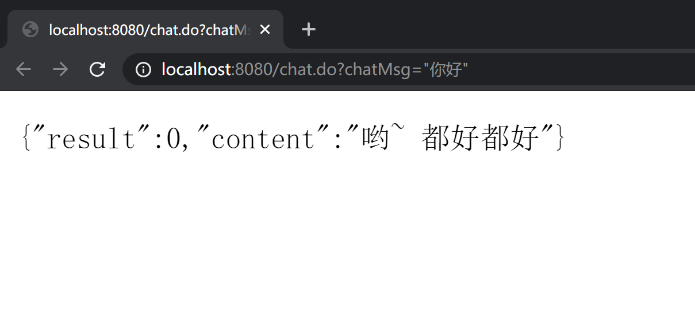

# 聊天机器人

## 后端

### 参考

- [青云客智能聊天机器人API](https://api.qingyunke.com/)
- http://api.qingyunke.com/api.php?key=free&appid=0&msg=%E7%8E%B0%E5%9C%A8%E5%87%A0%E7%82%B9
- [从零开始嵌入聊天机器人服务(小白适用)_qq_46993700的博客-CSDN博客](https://blog.csdn.net/qq_46993700/article/details/106216611)

### 实现

#### 总述

客户端：网页里的聊天界面 用 html css 写的。当点击发送消息，消息通过 AJAX 				请求发送到服务端。

服务端：用 SSM 框架写的java代码，在 Tomcat 里运行，用于接收客户端请求，获				取客户端发来的聊天信息

青云客智能聊天机器人API：上面的服务端调用此 API（服务端发起一个 HTTP   				

​			 请求，携带聊天信息给 API），API收到信息并处理，返回答复。服务端  			     			 收到答复消息，返回给客户端。

其实客户端也可以直接调用 API，不过按老师要求来说需要在服务端调用。


- 用户前端页面发出 AJAX 请求，服务器 Controller 处理

- 服务器发出 HTTP 请求，调用聊天机器人 API   

  - QingYunKeRobot.java

    发送 HTTP 请求，调用 API

  - ChatBotService.java

    调用 QingYunKeRobot 的实例对象

- 从 API 得到数据，再将数据返回给前端，只需要一个 Controller
  - ChatBotController.java
- 前端收到数据后在页面中显示
  - 前端页面

## 后端测试

### TestRobots.java

测试服务器发送 HTTP 请求给 聊天机器人 API 是否能成功得到返回值


### Controller

由于不知道怎么直接在后端代码中测试，选择前端访问后端对应的网址进行测试。

#### 错误1 @Autowired 注解自动注入失败


报错信息：

```
Unsatisfied dependency expressed through field 'chatBotService'; nested exception is org.springframework.beans.factory.NoSuchBeanDefinitionException: No qualifying bean of type 'service.ChatBotService' available: expected at least 1 bean which qualifies as autowire candidate. Dependency annotations: {@org.springframework.beans.factory.annotation.Autowired(required=true)}
```

解决：报错信息说 @Autowire 注解注入失败，没有对应的 JavaBean，本项目的确没使用到 Java Bean，所以用手动创建对象代替。


之前的

```java
@Autowired
private ChatBotService chatBotService;

@Controller
public class ChatBotController {

    @RequestMapping(value = "/chat.do", method = RequestMethod.GET)
    @ResponseBody
    public String getChatResponse(...){
        ...
}
```

修改后的

```java
@Controller
public class ChatBotController {

    private ChatBotService chatBotService;

    @RequestMapping(value = "/chat.do", method = RequestMethod.GET)
    @ResponseBody
    public String getChatResponse(...){
        chatBotService = new ChatBotService();
        ...
}
```

#### 错误2：返回中文乱码

- 中文乱码

  

- 英文正常

  

由于我是直接返回字符串类型

- [Spring Mvc @ResponseBody String返回中文字符串乱码_LittleSkey的博客-CSDN博客](https://blog.csdn.net/LittleSkey/article/details/52841148)

  用的第一种解决方式

  @RequestMapping 注解加入

  ```
  produces = "application/json; charset=utf-8"
  ```

输入：你好



输入：can you speak English


## 前端

[web前端 网页智能机器人_canyuexifeng的博客-CSDN博客_网页机器人](https://blog.csdn.net/weixin_44752891/article/details/89740289?utm_medium=distribute.wap_relevant.none-task-blog-BlogCommendFromMachineLearnPai2-2.wap_blog_relevant_pic&depth_1-utm_source=distribute.wap_relevant.none-task-blog-BlogCommendFromMachineLearnPai2-2.wap_blog_relevant_pic)

HTML + CSS + VUE

需要修改 AJAX 请求的地址

## Linux 部署


